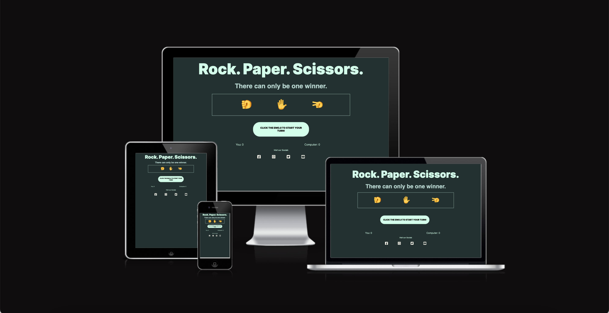

# Rock, Paper, Scissors 

*I would just like to state that I am dsylexic, so if there are spelling, grammatical errors or mistakes please bare with me.*

My idea for this project was to create a Rock, Paper Scissors game

# Table of Contents
[UX](#ux)
[Site purpose](#site-purpose)
[User Purpose]()

# UX 
Rock paper scissors is a simple, easy and fun game to play by yourself. It can also be used to make decision based on the loser or winner. 

### User Purpose
Simpel to understand. The user should be able to easily navigate the game and the website, knowing exactly what buttons to push and what thier score is. The user should know if they have won/lost/drawn the game easily, as it will appear in the button telling them what to do and the result of the scoreboard each time.

### User Goals
To play the rock, paper, scissors game as displayed on the screen and be able to easily nagivate around it.

# Design

### Colour Scheme
I went for darker toned colours, which are all in the same tone range back the dark green background, to make the design feel clean and easy to read. It also gives the illusion of no age range, which is what I was aiming for as I want my game to be played by all ages.

### Typography
I used [Google Fonts](https://fonts.google.com/) to source my typography. I sourced two typefaces called 'Archivo' and 'Inter' but I only used 'Inter' for all of my tyepfaces, heading and body copy. I did this for simplicity, so the user doesn't get overwhelemd with too amy typefaces. In addition I used a bold sans serif, which again, makese it easier to read and keeps the design much simpler.

### Wire Frames
I sketched out a few ideas to see which one would look the best, I decided that the middle one was the best design again to keep the simplisicity and not make it overly complex. In addition to this, I also worked out the logic of the game, which element would lose/draw/win against each other. The sketches are displayed below. 

# Features
I made the design as simple as possible so it doesn't so it's easy for the user to follow and the page is split into three simple sections. 

### Header 
The header is displayed below. It clearly displays the name, and a little bit of suspence body copy underneath in the sub heading. It displays the options of the game too.
 

### Game Area 
The game area displays the buttons that the user needs to click in order to start the game. 

### Score section
The score section that keep the score visible to the user and the lets the user know who won each round. 

### Future Implementations 
- To set a break for best out of 5.
- To be able to start over without having to refresh the browser.

