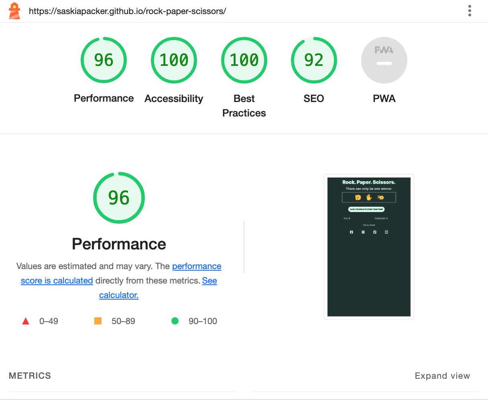

# Rock, Paper, Scissors 

*I would just like to state that I am dsylexic, so if there are spelling, grammatical errors or mistakes please bare with me.*

My idea for this project was to create a Rock, Paper, Scissors game.

The deployed website can be found [here.](https://saskiapacker.github.io/rock-paper-scissors/)

# Table of Contents
[UX](#ux)
- [User Purpose](#user-purpose)
- [User Goals](#user-goals)

[Design](#design)
- [Colour Scheme](#colour-scheme)
- [Typography](#typography)
- [Wire Frames](#wire-frames)

[Features](#features)
- [Header](#header)
- [Game Area](#game-area)
- [Score Section](#score-section)
- [Future Implementation](#future-implementations)
- [Accessbility](#accessibility)

[Technologies Used](#technology-used)
- [Languages Used](#languages-used)
- [Local Deployment](#local-deployment)

[Deployment and Local Development](#deployment-and-local-development)
- [Deployment](#deployment)
- [Local Deployment ](#local-deployment)
- [How To Fork](#how-to-fork)
- [How to clone](#how-to-clone)

[Testing](#testing)
- [Solved Bugs](#solved-bugs)

[Credits](#credits)
- [Content](#content)
- [Media](#media)
- [Acknowledgements](#acknowledgements)

# UX 
Rock paper scissors is a simple, easy and fun game to play by yourself. It can also be used to make decision based on the loser or winner. 

### User Purpose
Simpel to understand. The user should be able to easily navigate the game and the website, knowing exactly what buttons to push and what thier score is. The user should know if they have won/lost/drawn the game easily, as it will appear in the button telling them what to do and the result of the scoreboard each time.

### User Goals
To play the rock, paper, scissors game as displayed on the screen and be able to easily nagivate around it.

# Design

### Colour Scheme
I went for darker toned colours, which are all in the same tone range back the dark green background, to make the design feel clean and easy to read. It also gives the illusion of no age range, which is what I was aiming for as I want my game to be played by all ages.

- The background colour is actually hex code #223130, rather than #222130 hex code. When typing this hex code in, it was a happy accident, but I think the green gives it a more visually appealing feel.

The colour pallette was created using [coolors.](https://coolors.co/)

### Typography
I used [Google Fonts](https://fonts.google.com/) to source my typography. I sourced two typefaces called 'Archivo' and 'Inter' but I only used 'Inter' for all of my tyepfaces, heading and body copy. I did this for simplicity, so the user doesn't get overwhelemd with too amy typefaces. In addition I used a bold sans serif, which again, makese it easier to read and keeps the design much simpler.

### Wire Frames
I sketched out a few ideas to see which one would look the best, I decided that the middle one was the best design again to keep the simplisicity and not make it overly complex. In addition to this, I also worked out the logic of the game, which element would lose/draw/win against each other. The sketches are displayed below. 

# Features
I made the design as simple as possible so it doesn't so it's easy for the user to follow and the page is split into three simple sections. 

### Header 
The header is displayed below. It clearly displays the name, and a little bit of suspence body copy underneath in the sub heading. It displays the options of the game too.
 

### Game Area 
The game area displays the buttons that the user needs to click in order to start the game. 

### Score section
The score section that keep the score visible to the user and the lets the user know who won each round. 

### Footer 
The footer gives the audience to go to the companies socials.

### Future Implementations 
- To set a break for best out of 5.
- To be able to start over without having to refresh the browser.

### Accessibility
- Semanctic HTML 
- Sufficient colour contrast 
- Aria labels and alt attributes 
- Large buttons so you're able to read thing easily

# Technologies Used 

### Languages Used
- HTML
- CSS
- Javascript

### Framesworks, Libraries & Programs Used
- Github 
- Codeanywhere 
- Google Fonts
- Js Hint
- W3 Schools 
- Google Dev Tools
- Am I responsive? 

# Deployment and Local Development 

## Deployment 
Github pages has been used to deploy the live website. The instructions to achieve this are below: 

- Login in (or sign up) to GitHub.
- In the top right had conrner, click your picture and then select 'your respoitories' 
- Find the respository for this project, rock-paper-scissors
- Click on the settings link in the left hand side navigation bar. 
- In the source section, choose main from the drop down menu, select branch menu. 
- Select root from the drop down, select folder menu 
- Click save. Your live Github pages is now deployed at the URL shown.

## Local Deployment 
### How To Fork 
To fork the Rock, Paper, Scissors repository: 
- Login in to GitHub (or sign up)
- Go to the repository for this project. /SaskiaPacker/rock-paper-scissors 
- Click fork in the to right corner. 

### How to Clone 
To clone the Rock, Paper, Scissors repository 
- Log in (or sign up to) GitHub. 
- Go to the respository for this project SaskiaPacker/rock-paper-scissors
- Click on the code button, select whether you would like to clone with HTTPS, SSH, or GitHub CLI and copy the link shown 
- Open the terminal in your code editor and change the current working directory to the location you want to use for the cloned directory. 
- Type 'git clone' into the terminal and then paste the link you copied in step 3. 
- Press Enter. 

# Testing 
- The chrome developer tool was used to find any issues while building the webpage. 

- The W3C validators for HTML and CSS were used when the website was finished. JS Hint was used for Javascript. 

- Lighthouse Testing 

### Solved Bugs 
- I originally had a non-breaking text element tag in my html for the result button, which effected the padding when designing in css. To solve this I just took the tag out and allowed the button to flow over two lines where neccissary. 

- When first loading the emoji's into my html and css, they had a white background box around them. To get rid of this, I just set the background to none when writing my css code.

- The favicon wouldn't load in the deployed website. I solve this by editing the file path and making sure everything was spelt correctly. This is what solved it.

# Credits 
Inspiration and code came from two different YouTube tutorials and other students' projects.
- [How to Build a Rock Paper Scissors Game with Html, Css, and Javascript (Part 2)](https://www.youtube.com/watch?v=Qqy8Ov3NWvQ&t=2946s&ab_channel=whatsdev)
- [How To Code Rock Paper Scissors In JavaScript](youtube.com/watch?v=1yS-JV4fWqY&ab_channel=WebDevSimplified)
-[3 ways to code Rock Paper Scissors in JavaScript (Beginner to Intermediate to Advanced!)](https://www.youtube.com/watch?v=RwFeg0cEZvQ&t=519s&ab_channel=CodewithAniaKub%C3%B3w)
- [https://github.com/Tanjava/RPSLS](https://github.com/Tanjava/RPSLS)
- [https://github.com/JordanKingVeoxyl/rock-paper-scissors-lizard-spock-final](https://github.com/JordanKingVeoxyl/rock-paper-scissors-lizard-spock-final)
- [https://github.com/Tanjava/RPSLS](https://github.com/Tanjava/RPSLS)
- [https://github.com/kera-cudmore/readme-examples/blob/main/milestone1-readme.md](https://github.com/kera-cudmore/readme-examples/blob/main/milestone1-readme.md)

### Content 
Written by Saskia Packer

### Media 
- Emoji's are from [Emojiedia](https://emojipedia.org/)
- Favicon came from [Favicon Generator](https://favicon.io/favicon-generator/)

### Acknowledgements 
I'd like to give a special thanks to my tutor Martina Terlevic, who has been really supportive in the process of making this website. 

